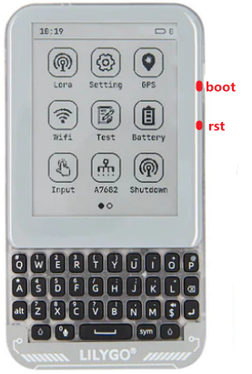
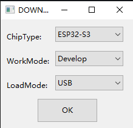
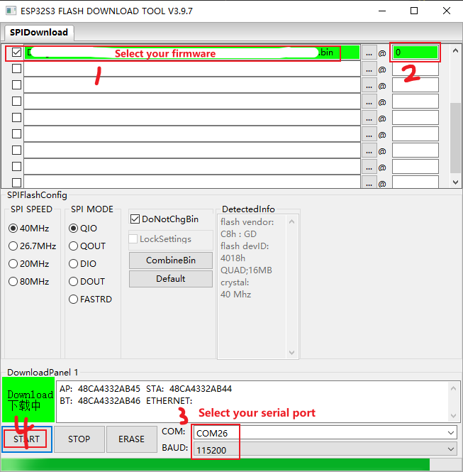

# Prepare

More documentation about flash_download_tools: [link](https://docs.espressif.com/projects/esp-test-tools/en/latest/esp32/production_stage/tools/flash_download_tool.html);

Download the `Flash Download Tools` , [Flash Download Tools](https://dl.espressif.com/public/flash_download_tool.zip);

First, plug in the Type-C data cable

# firmware download step

1、 Enter download mode

:one: Press the "boot" key and do not release it. 

:two: Click the "rst" button and then release it immediately. 

:three: Finally, release the boot key

2、Open the `Flash Download Tools` tool and select from the following figure;

3、Select the program you want to download and click Start key to download it as shown in the image below;

