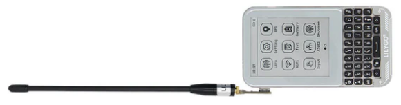

<h1 align = "center">🏆T-Deck-Pro MAX V0.1🏆</h1>

 
<!-- </a> -->
</a>
</a>

## :zero: Version 🎁

**T-Deck-Pro MAX V0.1** Revision Update Notes: 

- Added the XL9555 IO expansion chip 

- Remove the distinction between the audio version and the 4G version. Now, integrate the 4G (A7682E) and the audio (ES8311) onto a single board. 

- Add a LoRa antenna selection switch, controlled by XL9555 to select the internal or external antenna. The default is the internal antenna. 

- Add an audio channel output selection switch, and control the selection of using A7682E / ES8311 audio output through XL9555. 

- Add the vibration motor driving chip DRV2605

### 1、Version

How to confirm that your device is `T-Deck-Pro MAX V0.1`?

Download the [WireScan](./firmware/examples/WireScan.bin) firmware and then open the serial port to confirm.

How to download the firmware? - [click me](./firmware/)

### 2、Where to buy.

[LilyGo Store](https://lilygo.cc/products/t-deck-pro)

## :one: Product 🎁

|       H693       |      T-Deck-Pro MAX V0.1       |
| :--------------: | :----------------------------: |
|       MCU        |            ESP32-S3            |
|  Flash / PSRAM   |            16M / 8M            |
|       LoRa       |             SX1262             |
|       GPS        |            MIA-M10Q            |
|     Display      |      GDEQ031T10 (320x240)      |
|    4G-Module     |             A7682E             |
| Battery Capacity |          3.7V-1500mAh          |
|   Battery Chip   | BQ25896 (0x6B), BQ27220 (0x55) |
|      Audio       |         ES8311 (0x18)          |
|      Touch       |         CST328 (0x1A)          |
|    Gyroscope     |        BHI260AP (0x28)         |
|     Keyboard     |         TCA8418 (0x34)         |
|   IO Expansion   |         XL9555 (0x20)          |
|      Motor       |         DRV2605 (0x5A)         |

A7682E https://en.simcom.com/product/A7682E.html

## :two: Module 🎁

Datasheets on the chip are available in [./hardware](./hardware/) directory.
~~~
zinggjm/GxEPD2@1.5.5
jgromes/RadioLib@6.4.2
lewisxhe/SensorLib@^0.2.0
mikalhart/TinyGPSPlus @ ^1.0.3
vshymanskyy/TinyGSM@^0.12.0
lvgl/lvgl @ ~8.3.9
lewisxhe/XPowersLib @ ^0.2.4
adafruit/Adafruit TCA8418 @ ^1.0.1
adafruit/Adafruit BusIO @ ^1.14.4
olikraus/U8g2_for_Adafruit_GFX@^1.8.0
adafruit/Adafruit GFX Library@^1.11.10
esphome/ESP32-audioI2S#v3.0.12
~~~

### 1. A7682E

A7682E is the LTE Cat 1 module that supports wirelesscommunication modes of LTE-FDD/GSM/GPRS/EDGE.   It supports maximum 10Mbps downlink rate and 5Mbps uplink rate. A7682E supports multiple built-in network protocols.

Insert the SIM card and it supports calls, text messages and internet access.

Test the functionality of the A7682E using [`examples/A7682E/test_AT`](https://github.com/Xinyuan-LilyGO/T-Deck-Pro/tree/master/examples/A7682E/test_AT)

Control Via AT Commands
~~~
Frequency Bands LTE-FDD B1/B3/B5/B7/B8/B20
GSM/GPRS/EDGE 900/1800 MHz
Supply Voltage 3.4V ~ 4.2V, Typ: 3.8V
LTE Cat 1   (Uplink up to 5Mbps, Downlink up to10Mbps)
EDGE        (Uplink/Downlink up to 236.8Kbps)
GPRS        (Uplink/Downlink up to 85.6Kbps)
Firmware update via USB/FOTA
Support language calls
Support sending and receiving SMS messages
network protocols (TCP/IP/IPV4/IPV6/Multi-PDP/FTP/FTPS/HTTP/HTTPS/DNS)
RNDIS/PPP/ECM
SSL
~~~
❗ Note: The speakers of A7682E and ES8311 are shared. Set `IO12` of `XL9555` to `HIGH` and output the audio of A7682E.
The sound is too weak. Set `IO06` of the `XL9555` to `HIGH` to enable the power amplifier. [example](./examples/A7682E/test_AT/test_AT.ino)

### 2. ES8311

❗ Note: The speakers of A7682E and ES8311 are shared. Set `IO12` of `XL9555` to `LOW` and output the audio of ES8311.
The sound is too weak. Set `IO06` of the `XL9555` to `HIGH` to enable the power amplifier.

### 3. LoRa

❗ Note:
| When using an external antenna, LoRa operates as shown in the following diagram;  It is necessary to set `IO04` of `XL9555` to `HIGH`.   When `IO04` of `XL9555` is at `LOW` level, the internal antenna (the default mode) is used. |
| :---------------------------------------------------------------------------------------------------------------------------------------------------------------------------------------------------------------------------------- |
|  |

## :three: Quick Start 🎁

🟢 PlatformIO is recommended because these examples were developed on it. 🟢 

### 1、PlatformIO

1. Install [Visual Studio Code](https://code.visualstudio.com/) and [Python](https://www.python.org/), and clone or download the project;
2. Search for the `PlatformIO` plugin in the `VisualStudioCode` extension and install it;
3. After the installation is complete, you need to restart `VisualStudioCode`
4. After opening this project, PlatformIO will automatically download the required tripartite libraries and dependencies, the first time this process is relatively long, please wait patiently;
5. After all the dependencies are installed, you can open the `platformio.ini` configuration file, uncomment in `example` to select a routine, and then press `ctrl+s` to save the `.ini` configuration file;
6. Click :ballot_box_with_check: under VScode to compile the project, then plug in USB and select COM under VScode;
7. Finally, click the :arrow_right:  button to download the program to Flash;

### 2、Arduino IDE

1. Install [Arduino IDE](https://www.arduino.cc/en/software)

2. Copy all files under `this project/lib/` and paste them into the Arduino library path (generally `C:\Users\YourName\Documents\Arduino\libraries`);

3. Open the Arduino IDE and click `File->Open` in the upper left corner to open an example in `this project/example/xxx/xxx.ino` under this item;

4. Then configure Arduino. After the configuration is completed in the following way, you can click the button in the upper left corner of Arduino to compile and download;

| Arduino IDE Setting                  | Value                              |
| ------------------------------------ | ---------------------------------- |
| Board                                | ***ESP32S3 Dev Module***           |
| Port                                 | Your port                          |
| USB CDC On Boot                      | Enable                             |
| CPU Frequency                        | 240MHZ(WiFi)                       |
| Core Debug Level                     | None                               |
| USB DFU On Boot                      | Disable                            |
| Erase All Flash Before Sketch Upload | Disable                            |
| Events Run On                        | Core1                              |
| Flash Mode                           | QIO 80MHZ                          |
| Flash Size                           | **16MB(128Mb)**                    |
| Arduino Runs On                      | Core1                              |
| USB Firmware MSC On Boot             | Disable                            |
| Partition Scheme                     | **16M Flash(3M APP/9.9MB FATFS)**  |
| PSRAM                                | **OPI PSRAM**                      |
| Upload Mode                          | **UART0/Hardware CDC**             |
| Upload Speed                         | 921600                             |
| USB Mode                             | **CDC and JTAG**                   |

## :four: Pins 🎁

~~~c
#pragma once

/**  I2C Address
 * 0x18 --- ES8311
 * 0x1A --- Touch
 * 0x20 --- XL9555
 * 0x28 --- Gyroscope
 * 0x34 --- Keyboard
 * 0x55 --- BQ27220
 * 0x5A --- Motor
 * 0x6B --- BQ25896
 */
#define BOARD_I2C_ADDR_ES8311      0x18
#define BOARD_I2C_ADDR_TOUCH       0x1A
#define BOARD_I2C_ADDR_XL9555      0x20
#define BOARD_I2C_ADDR_GYROSCOPDE  0x28
#define BOARD_I2C_ADDR_KEYBOARD    0x34
#define BOARD_I2C_ADDR_BQ27220     0x55
#define BOARD_I2C_ADDR_MOTOR       0x5A
#define BOARD_I2C_ADDR_BQ25896     0x6B

// IIC
#define BOARD_I2C_SDA  13
#define BOARD_I2C_SCL  14

// XL9555 IO expansion 
#define BOARD_XL9555_INT            (-1)
#define BOARD_XL9555_SDA            BOARD_I2C_SDA
#define BOARD_XL9555_SCL            BOARD_I2C_SCL
#define BOARD_XL9555_00_6609_EN     (0)     // HIGH: Enable the A7682E power supply
#define BOARD_XL9555_01_LORA_EN     (1)     // HIGH: Enable the SX1262 power supply
#define BOARD_XL9555_02_GPS_EN      (2)     // HIGH: Enable the GPS power supply
#define BOARD_XL9555_03_1V8_EN      (3)     // HIGH: Enable the BHI260AP power supply
/* LORA_SEL determines whether to use the internal antenna 
/  or the external antenna; Connected to XL9555 IO04
/   HIGH --- external antenna
/   LOW --- internal antenna  */
#define BOARD_XL9555_04_LORA_SEL    (4)
#define BOARD_XL9555_05_MOTOR_EN    (5)     // HIGH: Enable the DRV2605 power supply
// Connected to XL9555 IO06, enable power amplifier,
// increase the volume of the speaker
#define BOARD_XL9555_06_AMPLIFIER    (6)     // HIGH: Enable power amplifier
#define BOARD_XL9555_07_TOUCH_RST   (7)     // LOW: Reset touch
#define BOARD_XL9555_10_PWEKEY_EN   (8)     // HIGH: Enable A7682E POWERKEY
#define BOARD_XL9555_11_KEY_RST     (9)     // LOW: Reset keyboard
/* Module A7682E and ES8311 share the output for headphones and speakers.
/  Select the audio output through AUDIO_SEL. When AUDIO_SEL is
/  HIGH : the headphones and speakers output the sound from A7682E.
/  LOW :  the headphones and speakers output the sound from ES8311. */
#define BOARD_XL9555_12_AUDIO_SEL   (10)
#define BOARD_XL9555_13             (11)    // Reserve
#define BOARD_XL9555_14             (12)    // Reserve
#define BOARD_XL9555_15             (13)    // Reserve
#define BOARD_XL9555_16             (14)    // Reserve
#define BOARD_XL9555_17             (15)    // Reserve

// Keyboard
#define BOARD_KEYBOARD_SCL BOARD_I2C_SCL
#define BOARD_KEYBOARD_SDA BOARD_I2C_SDA
#define BOARD_KEYBOARD_INT 15
#define BOARD_KEYBOARD_LED 42
#define BOARD_KEYBOARD_RST BOARD_XL9555_11_KEY_RST  // Connect the IO11 of the chip XL9555

// Touch
#define BOARD_TOUCH_SCL BOARD_I2C_SCL
#define BOARD_TOUCH_SDA BOARD_I2C_SDA
#define BOARD_TOUCH_INT 12
#define BOARD_TOUCH_RST BOARD_XL9555_07_TOUCH_RST   // Connect the IO07 of the chip XL9555

// Gyroscope
#define BOARD_GYROSCOPDE_SCL BOARD_I2C_SCL
#define BOARD_GYROSCOPDE_SDA BOARD_I2C_SDA
#define BOARD_GYROSCOPDE_INT 21
#define BOARD_GYROSCOPDE_RST -1

// Motor
#define BOARD_MOTOR_SCL BOARD_I2C_SCL
#define BOARD_MOTOR_SDA BOARD_I2C_SDA
#define BOARD_MOTOR_EN BOARD_XL9555_05_MOTOR_EN     // Connect the IO05 of the chip XL9555

// ES8311
#define BOARD_ES8311_SCL BOARD_I2C_SCL
#define BOARD_ES8311_SDA BOARD_I2C_SDA
#define BOARD_ES8311_MCLK       38
#define BOARD_ES8311_SCLK       39
#define BOARD_ES8311_ASDOUT     40
#define BOARD_ES8311_LRCK       18
#define BOARD_ES8311_DSDIN      17

// SPI
#define BOARD_SPI_SCK  36
#define BOARD_SPI_MOSI 33
#define BOARD_SPI_MISO 47

// Display
#define BOARD_EPD_BL   41
#define BOARD_EPD_SCK  BOARD_SPI_SCK
#define BOARD_EPD_MOSI BOARD_SPI_MOSI
#define BOARD_EPD_DC   35
#define BOARD_EPD_CS   34
#define BOARD_EPD_BUSY 37
#define BOARD_EPD_RST  9

// SD card
#define BOARD_SD_CS   48
#define BOARD_SD_SCK  BOARD_SPI_SCK
#define BOARD_SD_MOSI BOARD_SPI_MOSI
#define BOARD_SD_MISO BOARD_SPI_MISO

// Lora
#define BOARD_LORA_SCK  BOARD_SPI_SCK
#define BOARD_LORA_MOSI BOARD_SPI_MOSI
#define BOARD_LORA_MISO BOARD_SPI_MISO
#define BOARD_LORA_CS   3
#define BOARD_LORA_BUSY 6
#define BOARD_LORA_RST  4
#define BOARD_LORA_INT  5

// GPS
#define BOARD_GPS_RXD 2
#define BOARD_GPS_TXD 16
#define BOARD_GPS_PPS 1

// A7682E Modem
#define BOARD_A7682E_RI     7
#define BOARD_A7682E_ITR    8
#define BOARD_A7682E_RXD    10
#define BOARD_A7682E_TXD    11
#define BOARD_A7682E_PWRKEY BOARD_XL9555_10_PWEKEY_EN   // Connect the IO10 of the expansion chip XL9555

// Boot pin
#define BOARD_BOOT_PIN  0
~~~

## :five: Test 🎁

Sleep power consumption.

## :six: FAQ 🎁

## :seven: Schematic & 3D 🎁

For more information, see the `./hardware` directory.

----
